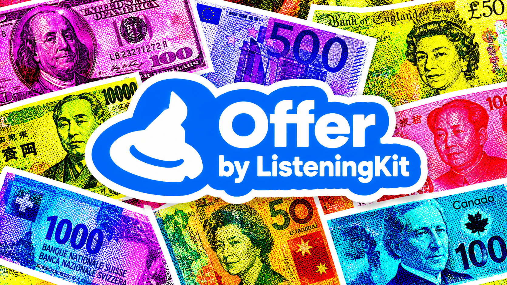
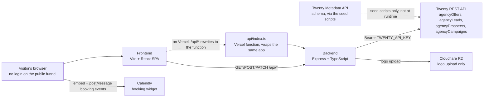
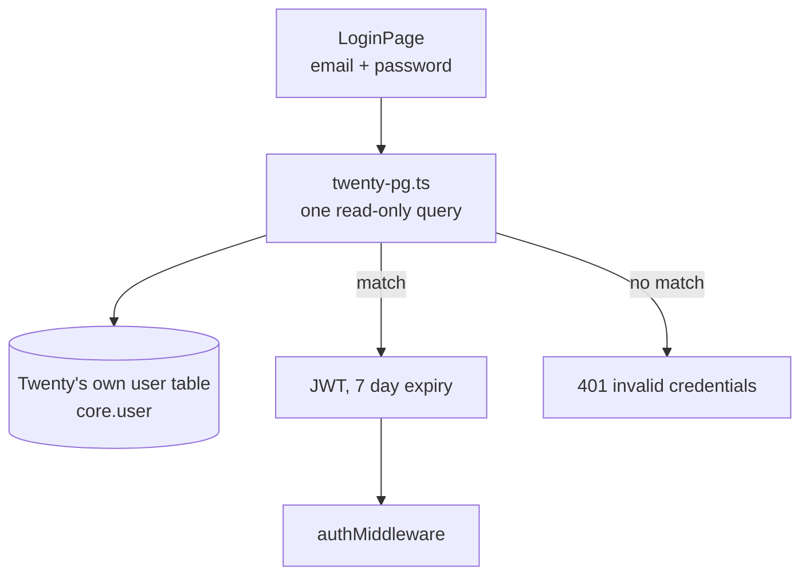

<p align="center">
  
</p>

# Offer

**Building a funnel and want the leads to land in your CRM instead of a
spreadsheet? [Talk to me on X](https://x.com/matthewsoldit).**

An open-source offer-funnel builder on [Twenty CRM](https://twenty.com). You
author an offer once, Twenty stores it, and the funnel renders from that record
— so editing the offer changes the live page immediately. No CMS, no build
step, no second database to keep in sync.

Every record Offer creates is a row in your own Twenty workspace. You can see
it, query it, and delete it from the CRM UI at any time.

---

## Contents

- [What it does](#what-it-does)
- [The workflow](#the-workflow)
- [Architecture](#architecture)
- [Where your data lives](#where-your-data-lives)
- [What is not built yet](#what-is-not-built-yet)
- [Use cases](#use-cases)
- [Setup](#setup)
- [Configuration](#configuration)
- [Deploying](#deploying)
- [API reference](#api-reference)
- [Development](#development)
- [Documentation map](#documentation-map)

---

## What it does

- **An offer editor.** Hero headline and subhead, a video, a qualifier quiz, a
  Calendly booking slot, brand assets, and a logo carousel. Five tabs, one
  record.
- **A public funnel per offer.** Shared link, or resolved automatically from a
  prospect. Anonymous visitors need no login.
- **Contact capture into your CRM.** The quiz posts to the API and creates a
  real `agencyLead` in Twenty, tagged `QUALIFIED` or `DISQUALIFIED`.
- **Booking state.** The Calendly widget reports back when a slot is booked, and
  the funnel swaps to a thank-you state with the offer's own videos.
- **A disqualified path.** Prospects who fail the qualifier get their own
  branch instead of a dead end.
- **Token substitution.** `{{city}}`, `{{area}}`, `{{name}}` and friends are
  resolved at render time from the prospect, so one offer serves a whole
  industry.

## The workflow

Four steps, end to end. This is the actual path through the code, not an
aspiration.

**1. Create the Twenty object once.** Offer is a Twenty custom object called
`agencyOffers`. Bootstrap it with the seed script, which is idempotent:

```bash
bun run --cwd backend seed
```

That creates the object and every field the editor writes. See
[docs/objects/agency-offer.md](docs/objects/agency-offer.md) for the field list.

**2. Author the offer.** Sign in, open **Offers**, create one. Fill in the
landing tab (headline, video, quiz), the thank-you and disqualified branches,
and the settings. Save. The editor `PATCH`es a single `agencyOffers` record
through a field allow-list, so the browser can never write a field the backend
does not expect.

**3. Share the link.** Each offer is reachable at:

| URL | Who it is for |
|---|---|
| `/offer/:slug` | anyone with the link |
| `/offer/prospect/:prospectKey` | one specific prospect, resolved via their campaign's industry |
| `/preview/:industryId/:id` | **you**, authenticated. Internal preview, not public. |

**4. The funnel runs.** A visitor lands, watches the video, answers the quiz,
leaves name / email / phone, books a slot. That creates the `agencyLead`. Once
Calendly confirms the booking, the page switches to the booked state.

Where the visitor came from is not lost either: `utmSource`, `utmMedium`,
`utmCampaign` and the rest are stored on the lead.

## Architecture

Three processes. The browser only ever talks to the frontend; the frontend
talks to the backend over `/api/*`; the backend is the only thing that talks to
Twenty.



A second, independent implementation of the same API lives in
`railcode/offer-builder/` as a Hono worker. It exists so the funnel can run
inside a private Railcode workspace. It is hand-synced, not generated, and
there is no tooling keeping the two in step — see
[Two backends](#two-backends).

## Where your data lives

There is no Offer database. This is worth being precise about, because it is
the thing that makes the project different.

**Twenty is the datastore.** Offers, leads, prospects and campaigns are all
Twenty records, reached over the REST API with `TWENTY_API_KEY`. There is no
ORM, no migration, and no second copy of your data.

**The one exception.** Signing in verifies a password against Twenty's own user
table, which needs a direct read-only connection:

```
backend/src/db/twenty-pg.ts   ->   SELECT ... FROM core."user" WHERE email = LOWER($1)
                                 then bcrypt.compare against passwordHash
```

That is a single query, read-only, and it exists only so Offer knows who is
logged in. It is optional: leave `TWENTY_DATABASE_URL` empty and password login
is disabled. No other code path touches Postgres.



**R2 is not your asset store.** It is used for exactly one thing: uploading a
brand logo via `POST /api/offers/logo-upload`, which `PUT`s the file straight
to the Cloudflare v4 API and returns a public URL. Offer does not proxy, sign,
or version R2 assets, and nothing else is stored there. If you need a real asset
pipeline, that is not built.

## What is not built yet

So you do not plan around features that do not exist:

- **No MCP server, and no API-first offer creation.** You create offers through
  the web editor today. The `skills/offer-maker/SKILL.md` in this repo is a
  prose runbook for an agent; it is not wired to a server or a CLI.
- **R2 handles logos only**, not a general asset library. The public base URL
  is currently a hardcoded subdomain in the source.
- **`videoMode` is read but has no writer.** No editor control and no create
  script, so it can only be set through the raw API.
- **`disqualifiedCalendlyUrl` is rendered but not writable** through the editor.
- **There is no test suite.** Nothing is covered by automated tests; the gates
  in [Development](#development) are typechecks and static checks only.
- **CSV import does not exist** in this project.

## Use cases

**A lead magnet or quote funnel per service line.** One offer per industry, all
sharing the same `industryId`. A prospect in autobody gets the autobody offer
even though there is only one page. Edit the price on one record and every
funnel for that industry updates.

**Qualify before your reps spend time.** The quiz is the filter. Answers decide
`QUALIFIED` versus `DISQUALIFIED` on the lead, so a rep opens Twenty and works a
list that is already sorted. The disqualification branch still gives the
prospect something useful instead of a dead end.

**Route by industry automatically.** A prospect arrives from a campaign; the
campaign carries an `industryId`; the funnel resolves to that industry's offer.
One link per prospect, no manual picking.

**Turn a call into a booked meeting.** Twenty holds the call, the offer holds
the pitch. Send the funnel link in the follow-up, the prospect books on
Calendly, and the booking lands back on the lead in the CRM.

**Sell without a website.** A shared `/offer/:slug` link is the whole funnel:
headline, proof video, qualification, capture, booking. Useful for a trade-show
QR code or a text message, where a full site is overkill.

**Run it privately.** The Railcode port runs the same funnel inside a
workspace where only signed-in members can reach it, for teams that do not want
a public page at all.

## Setup

You need Node 20+, `bun`, a Twenty workspace with an API key, and one Twenty
object (`agencyOffers`) plus its fields.

```bash
git clone https://github.com/matthewdonsemail-lab/offer.git
cd offer

bun install                       # root, backend, frontend (workspaces)
cp .env.example .env.local        # then fill it in, see below
bun run seed                      # create agencyOffers + fields, idempotent
bun run dev                       # backend :4000, frontend :3000
```

Open http://localhost:3000. Sign in with an account that already exists in
Twenty — signup is disabled, because Offer verifies against Twenty's users
rather than keeping its own.

If `TWENTY_DATABASE_URL` is unreachable the backend still runs; only password
login is disabled, and `GET /api/health` reports which pieces are configured.

## Configuration

Everything is in `.env.example`. Nothing here has a default that works in
production.

```env
# Twenty CRM. Required. The backend normalises a trailing /rest either way.
TWENTY_BASE_URL=https://twenty.example.com
TWENTY_API_KEY=

# Optional. Enables password login. Read-only, single table, one query.
# Without it, password login is disabled and the rest still works.

# Server
PORT=4000

# Signs the session JWT. Generate a real one.
JWT_SECRET=

# Cloudflare R2. Only needed for POST /api/offers/logo-upload.
CLOUDFLARE_ACCOUNT_ID=
CLOUDFLARE_R2_API_TOKEN=      # CLOUDFLARE_API_TOKEN is accepted as an alias
R2_BUCKET=

# Frontend. Browser-visible, so no secrets here.
# Leave UNSET in production so the SPA uses same-origin /api/*.
VITE_API_URL=http://localhost:4000
```

`scripts/check-env.mjs` runs on pre-push and fails if code reads an env var that
is not documented in `.env.example`.

## Deploying

**Vercel** serves the SPA and the API from one project. `vercel.json` rewrites
`/api/*` to `api/index.ts`, a serverless function that wraps the same Express
app, and everything else to `index.html`.

```bash
vercel env add TWENTY_API_KEY production
vercel env add JWT_SECRET production
vercel --prod
```

Note that `vercel.json` sets `installCommand: npm install` while the build runs
through `bun`. Both lockfiles are committed for that reason. If you switch the
install command, drop the one you no longer use.

The Content-Security-Policy `frame-ancestors` in `vercel.json` allows the
funnel to be embedded in Twenty. It also lists a few private tailnet
hostnames — worth trimming before you rely on it in production.

**Railcode** runs the same API as a private Hono worker:

```bash
cd railcode/offer-builder
bun install
railcode dev
railcode deploy
```

> **A push can deploy this.** `lefthook.yml` runs `railcode deploy` on any push
> that touches `railcode/offer-builder/**`. That is deliberate — it is what
> stops the two backends drifting — but it means pushing to this repo can ship
> to the live app. It needs `railcode login` first.

## API reference

Mounted by `backend/src/index.ts`. The Railcode worker serves the same paths.

| Method | Path | Auth | What it does |
|---|---|---|---|
| GET | `/api/health` | no | Which integrations are configured |
| POST | `/api/auth/login` | no | Verify against Twenty, issue a JWT |
| POST | `/api/auth/signup` | no | Always 403. Signup is disabled. |
| GET | `/api/auth/me` | yes | Current user |
| GET | `/api/offers` | yes | List offers |
| GET | `/api/offers/:id` | yes | One offer |
| POST | `/api/offers` | yes | Create, through the field allow-list |
| PATCH | `/api/offers/:id` | yes | Update, through the field allow-list |
| DELETE | `/api/offers/:id` | yes | Delete |
| POST | `/api/offers/logo-upload` | yes | Multipart image to R2, returns a URL |
| GET | `/api/industries` | yes | Distinct campaign industries |
| GET | `/api/prospects` | yes | Prospects and leads, for the picker |
| POST | `/api/leads` | **no** | Create a lead from the quiz |
| GET | `/api/leads` | yes | List leads |
| DELETE | `/api/leads/:id` | yes | Delete a lead |
| GET | `/api/public/offers/:slug` | **no** | Resolve an offer by slug or id |
| GET | `/api/public/offers/by-prospect/:key` | **no** | Resolve an offer via the prospect's campaign |
| GET | `/api/public/prospects/:key` | **no** | The little the funnel needs about a prospect |
| POST | `/api/public/leads` | **no** | Same as `/api/leads` |

The public routes are what a visitor hits. They return only the fields the
funnel renders, and they accept no write other than creating a lead.

## Development

```bash
bunx lefthook install        # once
```

Five pre-push gates:

| Gate | Fails when |
|---|---|
| `scripts/check-env.mjs` | code reads an env var that is not in `.env.example` |
| `scripts/scan-secrets.mjs` | a real env file, JWT, key, or credentialed DB URL is staged |
| `scripts/check-encoding.mjs` | a tracked file contains mojibake |
| `bun run --cwd frontend typecheck` | the frontend does not typecheck |
| `bun run --cwd backend typecheck` | the backend does not typecheck |

Both typechecks are clean. There is no test suite and no lint configuration;
`frontend`'s old `lint` script was removed because ESLint was never installed
and had no config, so it could only ever fail.

> **The encoding gate exists because of a real accident.** Windows PowerShell
> 5.1 `Get-Content` reads as Windows-1252, not UTF-8, so a file round-tripped
> through `Get-Content | WriteAllLines` silently turns every em dash into 17
> code points of garbage — and it still looks plausible in a diff. That shipped
> here once. The gate tells you to revert, not to re-run the pipeline that
> caused it.

### Two backends

`backend/` (Express) and `railcode/offer-builder/server/` (Hono) implement the
same routes against the same Twenty objects. They are maintained by hand. The
UI in `railcode/offer-builder/frontend/src/` is a near-copy of
`frontend/src/`, differing only in `App.tsx` and `LoginPage.tsx`.

There is no codegen or sync check between them. **A fix to a shared behaviour
has to be made twice.** That is the main maintenance cost in this repo, and it
is why the Railcode deploy is wired into the pre-push hook.

## Documentation map

| Document | What it covers |
|---|---|
| [docs/objects/agency-offer.md](docs/objects/agency-offer.md) | The offer record and its fields |
| [docs/objects/agency-lead.md](docs/objects/agency-lead.md) | Captured leads |
| [docs/objects/agency-prospect.md](docs/objects/agency-prospect.md) | Prospects |
| [docs/objects/agency-campaign.md](docs/objects/agency-campaign.md) | Campaigns and industry routing |
| [docs/objects/agency-phone.md](docs/objects/agency-phone.md) | Phone numbers |
| [docs/objects/conventions.md](docs/objects/conventions.md) | Naming and field conventions |
| [skills/offer-maker/SKILL.md](skills/offer-maker/SKILL.md) | A runbook for an agent working in this repo |
| [.env.example](.env.example) | Every variable, annotated |

> **No LICENSE file yet.** This repo does not currently declare a license, so
> "open source" is an intention rather than a legal fact. Add a `LICENSE` before
> treating it as publishable.

---

<!-- footer:offer-set:start -->
## Support

If this is useful, a star helps someone else find it.

[](https://github.com/matthewdonsemail-lab/offer/stargazers)
[](https://github.com/matthewdonsemail-lab/offer/network/members)
[](https://github.com/matthewdonsemail-lab/offer/watchers)
[](https://github.com/matthewdonsemail-lab/offer/commits)
[](https://github.com/matthewdonsemail-lab/offer/blob/main/LICENSE)

[](https://github.com/matthewdonsemail-lab/offer)
[](https://x.com/matthewdonsemail)
[](https://github.com/matthewdonsemail-lab/offer/issues)
[](https://github.com/matthewdonsemail-lab/offer/pulls)

## Star history

[](https://star-history.com/#matthewdonsemail-lab/offer&Date)
<!-- footer:offer-set:end -->

